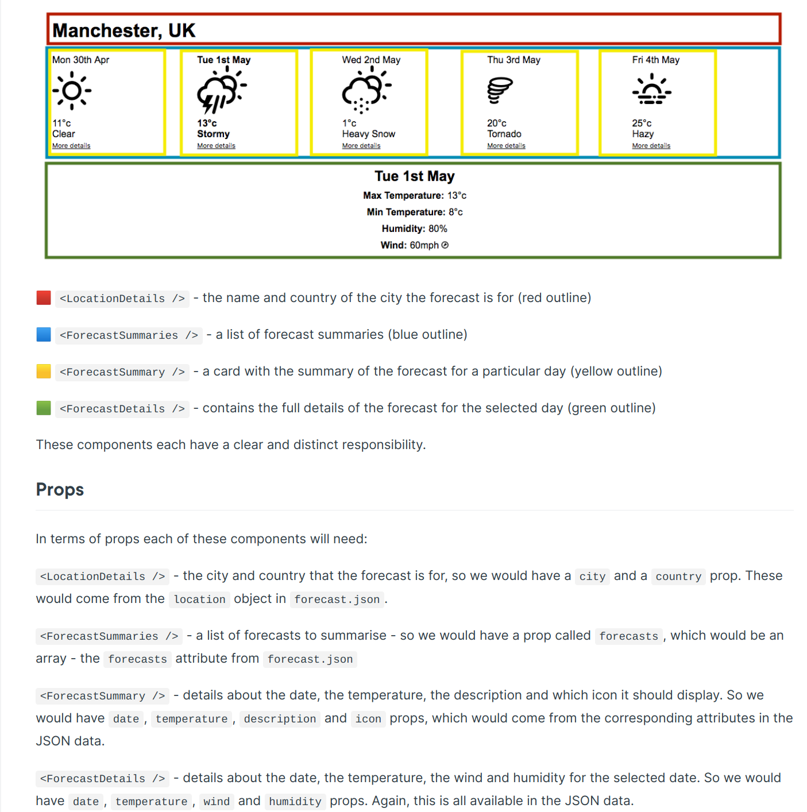

# Weather App 🌳🧘🏼🌤

## Introduction

This repo is an exercise in React app development.  
I'll create a weather app using React and related technologies.

---

## Running the App

To launch the app run the console command `npm start` from root.

---

## Resource Notes

The app will fetch data from a weather API.

The data will be in [this format](https://s3.eu-west-2.amazonaws.com/mcrcodes/weather/forecast.json).

Time will be in [unix time in milliseconds](https://en.wikipedia.org/wiki/Unix_time).

---

## Development Notes

App format:

---
## Quick Links

- [Components and Rendering](https://hackmd.io/s/ryKpNrWKV)
- [React Testing Library](https://testing-library.com/docs/react-testing-library/intro/)
    - [Cheatsheet](https://testing-library.com/docs/react-testing-library/cheatsheet/) 
- [Props](https://hackmd.io/s/BkA-BB-FN)
- [Prop-Types](https://www.npmjs.com/package/prop-types)
